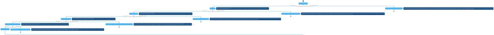
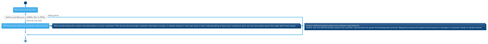
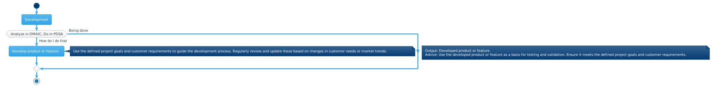
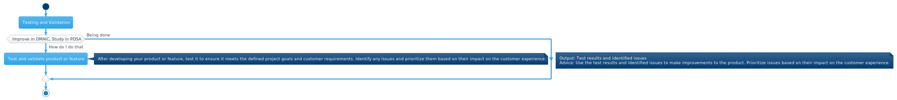
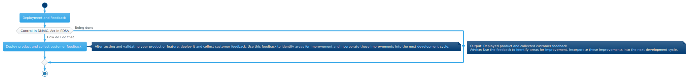
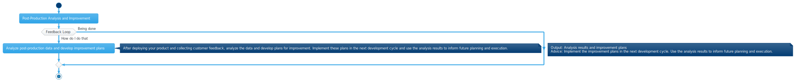

# Extras

Here are some SVG diagrams of the actions described in the presentation.

----
# The Full Process

----
## Planning and Execution

## Development

## Testing and Validation

## Deployment and Feedback

## Post-Production Analysis and Improvement

